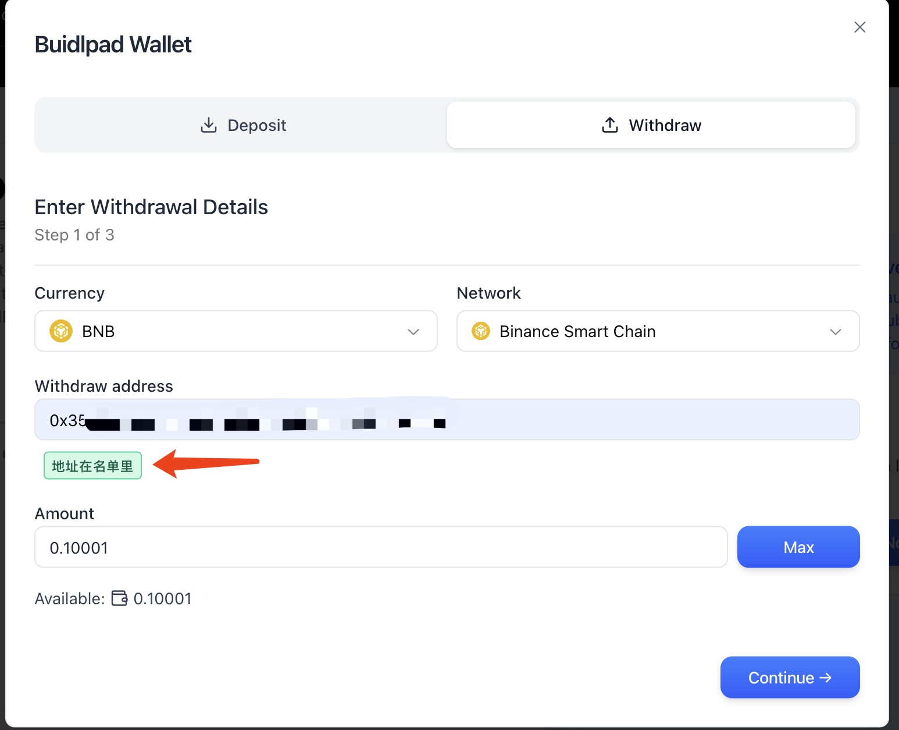
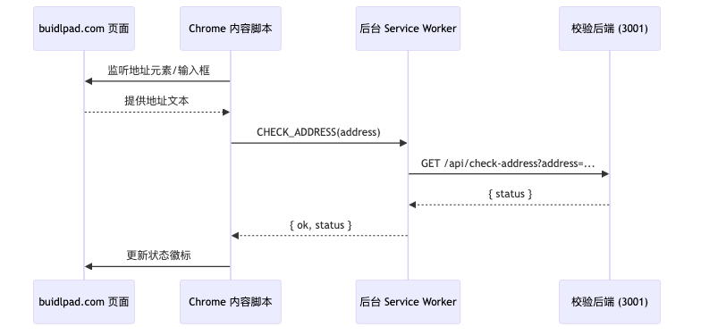
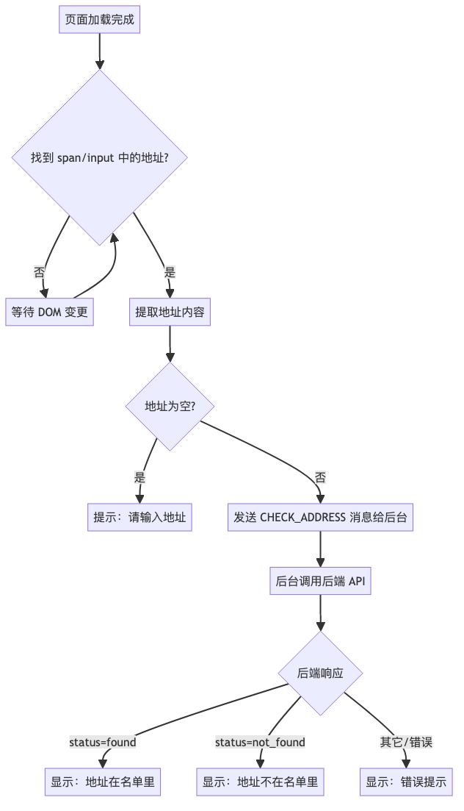

# Buidlpad Withdraw Address Checker

Chrome 扩展 + Node.js 后端，用于校验 [https://buidlpad.com/](https://buidlpad.com/) 页面上的提现地址是否在白名单内。

## 示意图





> 提示：以上示意图包含可扫码测试的示例二维码，便于验证后端连通性。

## 环境要求

- Node.js 18 LTS（开发与部署均使用 v18.19.1）
- npm 9.x（随 Node 18 提供）
- Chrome 114+（Manifest V3 支持）

## 快速开始

```bash
npm install
```

### 启动后端（开发环境）

```bash
npm run dev:backend
```

- 默认监听 `http://0.0.0.0:3001`（可在局域网访问）
- 白名单文件：`backend/address.txt`，每行一个地址（忽略大小写）。修改文件后，无需重启即可生效。

### 启动扩展打包（开发环境）

```bash
npm run dev:extension
```

- 首次运行会生成 `extension/dist`
- Chrome 打开 `chrome://extensions` → 打开“开发者模式” → “加载已解压的扩展程序”，选择 `extension/dist`
- 修改源码后，`dev:extension` 会自动增量构建；在扩展管理页点击“刷新”即可加载最新代码。

### 配置后端地址

- 扩展读取 `extension/config.json` 中的 `apiBaseUrl`（默认示例：`http://192.168.1.102:3001/api/check-address`）
- 部署后端到服务器后，将该字段改为目标地址并重新构建/打包
- 若需要访问其它域名/端口，可更新 `extension/manifest.json` 的 `host_permissions`

### 构建发布包

```bash
npm run build:extension
```

生成的产物位于 `extension/dist`，可直接用于 Chrome 商店或线下分发。

## 部署后端到服务器

1. 在服务器安装 Node 18（或保持与开发一致的版本）
2. 安装依赖并启动服务：
   ```bash
   cd ~/buidlpad_withdraw
   npm install --production
   node backend/server.js
   ```

## 扩展工作原理概览

- 内容脚本加载后监听提现地址的 `span` 及 `input[name="address"]`
- 捕获到地址后向后台 Service Worker 发送校验请求
- 后台读取 `config.json` 中的后端地址，发起 GET 请求
- 根据响应结果在页面上输出中文提示（绿色通过、红色未命中或异常）

更多细节可参考源码中的注释以及上方的时序/流程图。

> ⚠️ 注意：插件通过监听 buidlpad.com 页面上的特定元素（`span.font-medium.font-mono.text-sm` 与 `input[name="address"]`）来获取地址。如果网站结构或类名发生变化，扩展可能会失效，需要同步更新选择器。
